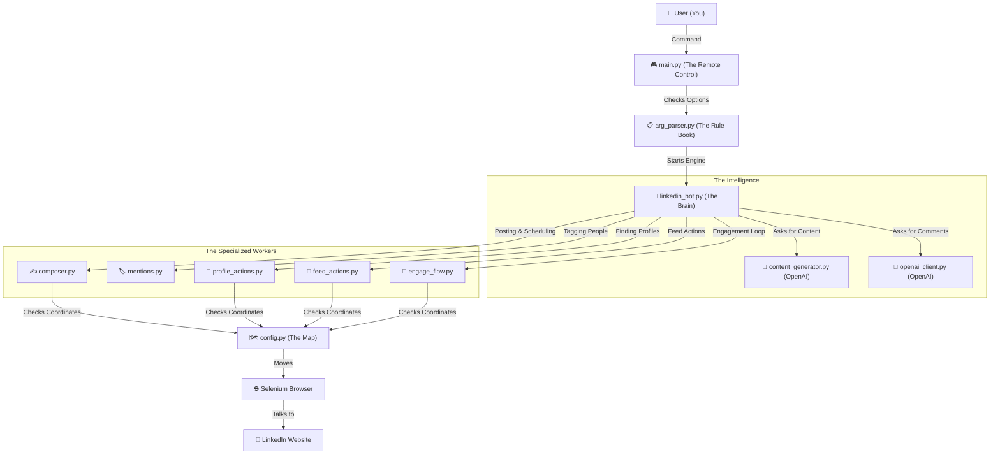

# LinkedIn Automation Framework (LAF) 🚀

## The Big Idea
**Win on LinkedIn while you sleep!** LAF is your personal AI partner that handles the "grunt work" of social growth—reading, thinking, and engaging—so you can focus on building your business.

## What is LAF?
LAF is a production-grade Python framework that automates a real Chromium browser to perform human-like actions on LinkedIn. Unlike brittle API-based tools, LAF interacts with the actual web UI, making it more resilient and authentic.

Whether you need a **Ghost Writer** to handle your daily posts, a **Party Animal** to keep your feed active, or a **Hunter** to build relationships with specific investors, LAF provides the command-line power to scale your presence with technical precision.

## Table of Contents
- [1. The Blueprint](#the-blueprint-how-it-works)
- [2. Feature Deep Dive](#feature-deep-dive-the-command-list)
- [3. Quick Start](#quick-start-run-it-in-60-seconds)
- [4. Global Switches](#global-switches)
- [5. Staying Safe](#staying-safe-safety--de-duplication)
- [6. The Map](#the-map-project-structure)
- [7. Evidence & Proof](#evidence--proof)
- [8. Documentation & Introspection](#documentation--introspection)
- [9. Contributing](#contributing)
- [10. Security](#security)
- [11. Code of Conduct](#code-of-conduct)
- [12. License](#license)

---

## The Blueprint (How it Works)

This map shows how your command travels from your keyboard to LinkedIn, and which files handle each step.



---

## Feature Deep Dive (The Command List)

### 1. The "Ghost Writer" (`post`) ✍️
This command puts your content live. It handles text formatting, image uploads, and precise scheduling.
- **Sub-Feature: Image Sampling:** Pick a folder, and the bot grabs random photos to vary your posts.
- **Sub-Feature: Time Traveler:** Set a specific date and time to publish in the future.
- **Sub-Feature: Auto-Topic:** Feed the bot a file of ideas, and it will pick, post, and track them.

**Common Options:**
- `--topics-file "topics.txt"`: Randomly pick a topic from your backlog.
- `--images-dir "./static"`: Attach random images from a directory.
- `--schedule-date "MM/DD/YYYY"` & `--schedule-time "HH:MM AM/PM"`: Automate the "Schedule" button.

### 2. The "Party Animal" (`engage`) 🔄
Keeps your account active by scrolling your feed and interacting with your network.
- **Sub-Feature: AI Chatter:** Writes context-aware, smart comments using OpenAI.
- **Sub-Feature: Safety Scroll:** Moves through the feed with human-like delays to protect your account.

**Common Options:**
- `--action [like|comment|both]`: Decide the level of engagement.
- `--max-actions 10`: Set a hard limit to prevent over-automation.
- `--include-promoted`: (Off by default) Decide if you want to talk to advertisers.

### 3. The "Hunter" (`pursue`) 🔎
Target specific profiles to build strategic relationships (e.g., Investors or CEOs).
- **Sub-Feature: Bio Matcher:** Only interacts if their bio contains specific keywords (e.g., "Venture").
- **Sub-Feature: Friend Maker:** Automatically follows the target after engaging with their content.

**Arguments & Options:**
- `profile_name`: The name to search for (e.g., "Lara Acosta").
- `--bio-keywords "investor" "startup"`: High-precision filtering.
- `--perspectives [funny|insightful]`: Control the "vibe" of the AI comments.

### 4. The "Echo" (`repost`) 📰
Share trending content with your own AI-generated or manual spin.
- **Sub-Feature: Author Shoutout:** Automatically tags the original creator for maximum reach.

### 5. The "Planner" (`generate-calendar`) 📅
Generate a comprehensive 30-day content strategy based on your niche and goals.

---

## Quick Start (Run it in 60 Seconds)

1.  **Setup Your ID**: Put your LinkedIn credentials in the `.env` file.
2.  **Setup Your Brain**: Add your `OPENAI_API_KEY` to the `.env` file.
3.  **Add Ideas**: List your post topics in `topics.txt`.
4.  **Go!**
    ```bash
    python main.py post --topics-file topics.txt
    ```

---

## Global Switches
*   `--headless`: Run in "Ghost Mode" (no browser window pops up).
*   `--debug`: Show detailed logs if you want to audit the bot's decisions.
*   `--no-ai`: Disables the AI "Brain" and uses your local templates instead.

---

## Staying Safe (Safety & De-duplication)
LAF is built with **Operational Credibility**. It doesn't just click; it remembers.
- **URN Deduplication**: Every post the bot interacts with is hashed and cached in `logs/engage_state.json`. It will **never** like or comment on the same post twice.
- **Human Pacing**: The bot "breathes" (pauses) and types letter-by-letter to mimic human behavior.
- **Smart Skip**: Automatically skips promoted content, posts you've already liked, or posts that already contain your comments.
- **Mention Reliability**: Author mentions are forced to the start of comments to trigger LinkedIn's typeahead tray reliably.

---

## The Map (Project Structure)

| File / Folder | Analogy | Purpose |
| :--- | :--- | :--- |
| `main.py` | **The Remote Control** | The CLI entry point for all robot commands. |
| `linkedin_bot.py` | **The Brain** | High-level orchestrator coordinating all workflows. |
| `config.py` | **The Map** | Central source for selectors, timeouts, and constants. |
| `composer.py` | **The Pen** | Handles the heavy lifting of post creation and scheduling. |
| `engage_dom.py` | **The Private Eye** | Scans the LinkedIn DOM to find authors, buttons, and URNs. |
| `mentions.py` | **The Tag** | Manages complex `@mention` insertion and verification. |
| `logs/` | **The Diary** | Stores session logs and the `engage_state.json` cache. |

---

## Evidence & Proof
LAF doesn't just run—it delivers.

[](https://www.linkedin.com/feed/update/urn:li:share:7378393785791156224)
> *Click the image to see a live post generated and published entirely by LAF.*


> *The bot drives real results—this comment reached over 600 unique impressions.*

---

## Documentation & Introspection
LAF is built for engineers. Every module and function includes **Why/When/How** docstrings.
You can inspect any command directly from your terminal:
```bash
python - <<'PY'
import inspect
from linkedin_bot import LinkedInBot
print(inspect.getdoc(LinkedInBot.pursue_investor))
PY
```

---

## Contributing
We welcome battle-hardened code.
1. Reproduce issues with `--debug` and provide logs.
2. Submit focused PRs with manual verification.
3. Read [CONTRIBUTING.md](CONTRIBUTING.md) for full details.

---

## Security
We take the security of your LinkedIn account seriously.
- Use sensible automation limits to avoid triggering anti-bot measures.
- Store your `.env` file securely and never share your credentials.
- If you discover a security vulnerability, please refer to our [SECURITY.md](SECURITY.md) for reporting instructions.

---

## Code of Conduct
All contributors and users are expected to adhere to our [CODE_OF_CONDUCT.md](CODE_OF_CONDUCT.md). We are committed to providing a welcoming and inclusive experience for everyone.

---

## License
Released under the [MIT License](LICENSE.md). Stay safe and automate responsibly.
